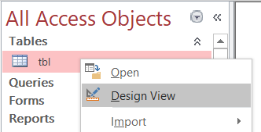
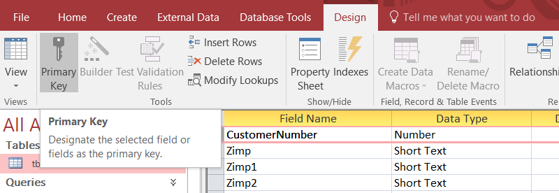
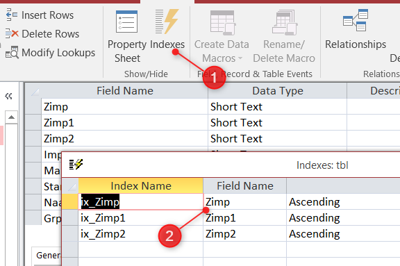
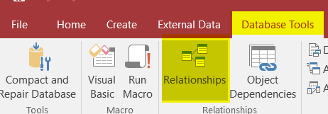
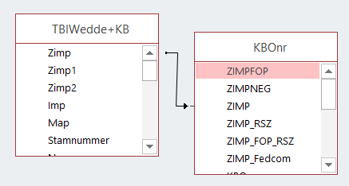

# Tables

## Add a primary key in each table

Depending on your data model, try to add a Primary key in each table.

For instance, if you've a Customer table, you'll probably have one field that one field that will define, without any doubt, a given customer; a field like `CustomerID` (whatever his name).

Examine all your tables and if you've such unique field, define that field as the Primary key.

If possible, a primary key should be

* only one field (you can indeed define several fields to be the key),
* a number, not a text field,
* smaller as possible (if you really need to use a text field, prefer a field with 5 characters f.i. and not 255)

Right-click on the table name and select `Design`.

Select the field then click on the `Primary key` button.

Be careful: be sure to correctly identify the unique field; don't add a primary key to f.i. a customer name (since more than one customer can have such name). A primary key will increase speed and data coherence in your table but will also prevent to have a second record with the same key (so, if you choose the wrong field, we can have side effect).

## Use indexes

Take a look to your queries: do you often make a filter on a specific field? You could have a very strong performance improvement by just adding an index for that field.

To do it, open your table in design mode by just right-clicking on the name of the table

Then click on the `Indexes` button to show a small window and, there, add indexes on important fields.

Note: don't abuse, don't `over-index` but add indexes only on fields often used in query's criteria since maintaining indexes ask CPU and thus has a cost on insert/update/delete statements.

## Create relationships between tables if possible

When you're using, in a query, two tables or more having a link between them, MS Access optimization technique suggest creating this link, also, in the relationships window i.e. at a global level.

To do this, once your database is opened, click on the `Database Tools` menu and choose `Relationships`.

Draw your relation, select carefuly the join type (which can be also adjusted in a query) and save the relations.

Example: link between two tables on the Zimp field. The arrow is draw from `TBlWedde+KB` to `KBOnr` (it's the `join type`) and this means: "take all records of `TBlWedde+KB` and, if the value is also known in `KBOnr` then return values.

Tip: always try to use an index for the relation and not "any field".

## Use the right data type and the right size

In your tables, try to correctly choose the data type:

* if you should store a True/False (or 1/0) information, choose a `Yes/No`
* if you need to store a small number (f.i. `Number of children`), don't choose Number - Long Integer when Number - Byte is enough,
* ...

And the right size: specially for text fields, don't use a 255 length (it's almost never needed) but try to think about the longest value (do you really have a customer with a family name of 255 characters? probably 50 will be enough).
