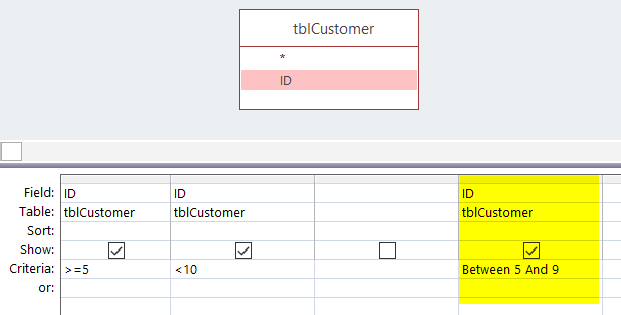
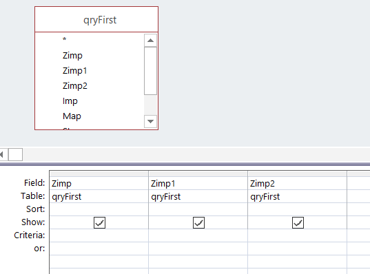
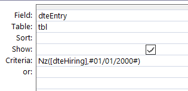
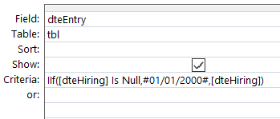
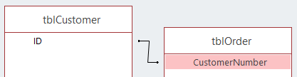
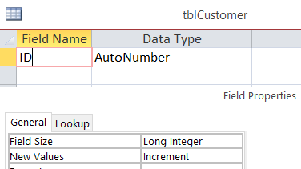
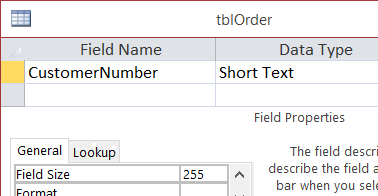

# Queries

## Use Between

When you need to write a `between` criteria, f.i. customer ID between 5 and 9, you can do this like this:



* Twice the same column, one with `>= 5` and the second with `< 10`
* Or in the same column using a `Between 5 and 9`

The best way is the yellow one: only one field and thus only one criteria to evaluate.

## Count the number of records

If you use the Count function to calculate the number of records returned by a query, use the syntax `Count(*)` instead of `Count([some_field])`.

`Count(*)` is faster since it doesn't have to check for Null values in the specified field and won't skip records that are null.

*By using `Count([some_field])` the number returned **can be lower** than the real number of records if the column `some_field` is sometime equal to the Null value.*

## Only needed fields

If you're using a query in another query like illustrated below, if you just need three fields in the second query, perhaps the first query can be modified and return only these three fields.



If, in this example, the query called `qryFirst` is only used by this second query, then you can modify the first query to only returned three columns.

The less data returned, the faster the query will be processed.

## Use Is Null and not IsNull()

In a query, use `Is Null` which is native in the SQL standard while `IsNull()` is, in fact, a VBA feature.

Using `IsNull()` is therefore slower than `Is Null`

So, avoid,

```SQL
SELECT ... FROM ... WHERE IsNull(fld)
```

And use,

```SQL
SELECT ... FROM ... WHERE (fld Is Null)
```

## Use Iif() and not NZ()

NZ() is a VBA feature: if a field is equal to the Null value, NZ() allow to return something else.

Iif() is native SQL.

Simplified illustration: if the hiring date is null, assumes that it was the 1st January 2000.

```SQL
SELECT NZ([dteHiring], #2000-01-01#) As dteEntry
```

The same can be also written like:

```SQL
SELECT Iif([dteHiring] Is Null, #2000-01-01#, [dteHiring]) As dteEntry
```

Why it's bad? **NZ() will return a variant object which is less performant because the .JET engine of MS Access treats Variants as Text**. In the first example `NZ([dteHiring], #2000-01-01#) As dteEntry`, the data type of dteEntry is therefore a text field, not a date.

So, in the example below, we're not comparing a date versus another date but a date `dteEntry` with a text (the result of the `NZ()` formula). So .JET engine will convert `dteEntry` to a text too. The conversion is therefore done twice and this is inefficient.



With `Iif([dteHiring] Is Null, #2000-01-01#, [dteHiring]) As dteEntry` the type remains a date field. So we can quickly solve the double conversion introduced by `NZ()` using this construction:



Here, .JET won't complain anymore and will immediately compare a date with an another date; faster.

## Avoid VBA functions

We've already see this. Use `Is Null` and not `IsNull()`, use `Iif` and not `NZ()` and this apply to a lot of others formulas.

### Year()

Year() is a VBA function. The query below requires that every single date are processed by Year() to determine the year before evaluating the criteria.

If there is an index on `dteHiring`, the index is ignored due to the VBA call.

```SQL
SELECT ... FROM ... WHERE (Year([dteHiring]) = 2018)
```

Prefer the native SQL `BETWEEN` verb:

```SQL
SELECT ... FROM ... WHERE ([dteHiring] between '1/1/2018 00:00:00' and '12/1/2018 23:59:59')
```

Here the index is well used, .JET also don't need to make VBA call record by record but can work on a set of records in one time.

### DCount(), DSum()

Prefer to rewrite the query and use, f.i., subqueries with a GROUP BY and the desired formula (Count(), Sum(), ...)

## Sorting on columns not formula's

If possible, it's better to use a sort feature on columns (so probably use indexes).

In the following example, ORDER BY is done on a formula (a string concatenation), no indexes can be used here, the time needed to sort records is slower.

```SQL
SELECT ClientID, Name + " " + FirstName As FullName
FROM tblClient
ORDER BY Name + " " + FirstName
```

In the example below, the result will be exactly the same except that if one or the two columns are indexed, the result will be faster.

```SQL
SELECT ClientID, Name + ", " + FirstName As FullName
FROM tblClient
ORDER BY Name, FirstName
```

## Use the same (or compatible) data type in join fields

When you make a link between two tables (with a join), try to respect the data type: avoid making a link between f.i. a number and a text field.

Consider the following example:



*The field `ID` in `tblCustomer` is a number*



*The field `CustomerNumber` in `tblOrder` is a text (and a big one)*



MS Access will be able to make the join and will make things working but, implicitly, will convert any fields so they have the same data type and this will cost CPU.

In this example, if possible, change the data type of  `CustomerNumber` in `tblOrder` to a `Long integer` so the fields will be compatible.

## First filter by using WHERE before HAVING

Totals queries (those with a `GROUP BY` clause) can have both a `WHERE` clause and a `HAVING` clause.

* `WHERE` is executed first **before aggregation**
* `HAVING` is executed afterwards **when the totals have been calculated**

Below, there is no `WHERE` clause: the calculation "How many invoices by customer" is made for all customers (several thousand maybe) and, once all this calculation is done, you just ask for figure for the customer 99. Rather very deficient.

```SQL
SELECT ClientID, Count(InvoiceID) AS HowMany
FROM tblInvoice
GROUP BY ClientID
HAVING ClientID = 99;
```

Take advantage of the `WHERE` priority and obtain the same information, much faster, like this:

```SQL
SELECT ClientID, Count(InvoiceID) AS HowMany
FROM tblInvoice
WHERE ClientID = 99
GROUP BY ClientID;
```

Here, .JET only take records for that customer before starting to count.

## If you're group on the primary key

As soon as you're using a GROUP BY in your SQL, every "not" calculated field should be mentioned in the GROUP BY clause.

Because we're not using a formula like Count(), Max(), ... on the LastName, that field should be mentioned in the GROUP BY clause so:

```SQL
SELECT EmployeeID, LastName, Count(Illness)
FROM Employees
GROUP BY EmployeeID, LastName
```

But, here, GROUP on the LastName is unnecessary because EmployeeID is already unique: when using the primary key in the GROUP BY, any other fields are needless and due to their presence, .JET will make grouping for nothing. Unneeded actions...

Because the primary key is in the GROUP BY clause, we can use such SQL:

```SQL
SELECT EmployeeID, First(LastName) AS LastName, Count(Illness) As IllDays
FROM Employees
GROUP BY EmployeeID
```

By using First() we allow .JET to only retain the first LastName for that Employee ID (and, of course, the employee has only one LastName).

This is therefore faster.
