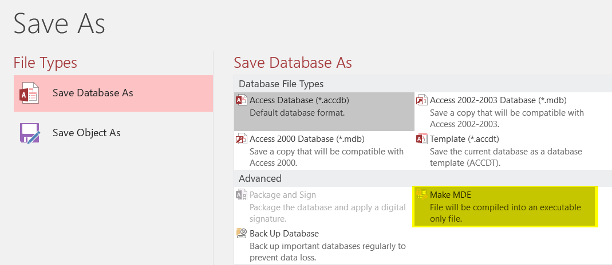

# Database

## Compact the database

If you've temporary tables, remove them before.

Compacting the database will free up spaces, remove unneeded objects and records, updates internal statistics and this will have a positive impact on performance.

## Save the database as a .mde file

**!!! Be careful !!!**

A .mde file is smaller and faster than a normal MS Access (.accdb file) but you can't modify anymore the structure of such file.

With a .mde, you'll no more be able to change the design of a table, add a field, modify your forms, ... but just use them.

**If you wish to use a .mde, always take a backup of your .accdb (or .mdb) file and keep it in a secured folder. Once more: if you don't have anymore the .accdb file but only the .mde, you won't be able to change the structure of the application, you won't be able to modify a macro, a form, ...**
