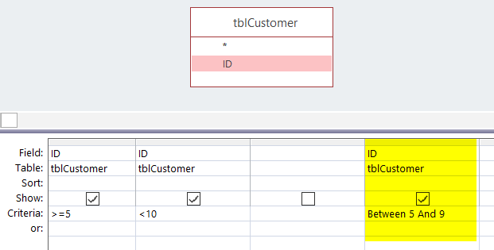
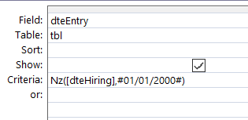

<!-- This file has been generated by the concat-md.ps1 script. -->
<!-- Don't modify this file manually (you'll loose your changes) -->
<!-- but run the tool once more -->

<!-- Last refresh date: 2021-03-22 10:39:43 -->

<!-- below, content of ./index.md -->

# How to optimize an existing MS Access database


>This guide deliberately concerns **existing databases**, for this reason, I will not speak for example about how to correctly design tables, not having more than 100 fields, not about drawing a relational schema, ... The objective is therefore to improve performance without deep programming (no reengineering) and without migration to f.i. SQL Server.

<!-- table-of-contents - start -->
* [MS Access - Analyze Performance](#ms-access-analyze-performance)
* [Do it yourself](#do-it-yourself)
  * [Tables](#tables)
    * [Add a primary key in each table](#add-a-primary-key-in-each-table)
    * [Use indexes](#use-indexes)
    * [Create relationships between tables if possible](#create-relationships-between-tables-if-possible)
    * [Use the right data type and the right size](#use-the-right-data-type-and-the-right-size)
  * [Queries](#queries)
    * [Use Between](#use-between)
    * [Count the number of records](#count-the-number-of-records)
    * [Only needed fields](#only-needed-fields)
    * [Use Is Null and not IsNull()](#use-is-null-and-not-isnull)
    * [Use Iif() and not NZ()](#use-iif-and-not-nz)
    * [Avoid VBA functions](#avoid-vba-functions)
      * [Year()](#year)
      * [DCount(), DSum()](#dcount-dsum)
    * [Sorting on columns not formula's](#sorting-on-columns-not-formulas)
    * [Use the same (or compatible) data type in join fields](#use-the-same-or-compatible-data-type-in-join-fields)
    * [First filter by using WHERE before HAVING](#first-filter-by-using-where-before-having)
    * [If you're group on the primary key](#if-youre-group-on-the-primary-key)
  * [Macros](#macros)
    * [Convert macros to modules](#convert-macros-to-modules)
  * [Modules](#modules)
    * [Save modules in a compiled state](#save-modules-in-a-compiled-state)
    * [Use Option Explicit statement](#use-option-explicit-statement)
    * [Unload references](#unload-references)
  * [Database](#database)
    * [Compact the database](#compact-the-database)
    * [Save the database as a .mde file](#save-the-database-as-a-mde-file)
* [Other tools](#other-tools)
  * [Script Get fields list](#script-get-fields-list)
    * [Prepare files](#prepare-files)
      * [access_get_fields_list.vbs](#access_get_fields_listvbs)
      * [access_get_fields_list.cmd](#access_get_fields_listcmd)
    * [Understand the report](#understand-the-report)
<!-- table-of-contents - end -->

<!-- below, content of ./010-analyze-perf/readme.md -->

## MS Access - Analyze Performance

MS Access 2016 provide a tool for analyzing the current database.


You can run the tool only for a selection like, f.i., only for queries.

<!-- below, content of ./020-do-it-yourself/readme.md -->

## Do it yourself

<!-- below, content of ./020-do-it-yourself/010_tables/readme.md -->

### Tables

#### Add a primary key in each table

Depending on your data model, try to add a Primary key in each table.

For instance, if you've a Customer table, you'll probably have one field that one field that will define, without any doubt, a given customer; a field like `CustomerID` (whatever his name).

Examine all your tables and if you've such unique field, define that field as the Primary key.

If possible, a primary key should be

* only one field (you can indeed define several fields to be the key),
* a number, not a text field,
* smaller as possible (if you really need to use a text field, prefer a field with 5 characters f.i. and not 255)

Right-click on the table name and select `Design`.


Select the field then click on the `Primary key` button.


Be careful: be sure to correctly identify the unique field; don't add a primary key to f.i. a customer name (since more than one customer can have such name). A primary key will increase speed and data coherence in your table but will also prevent to have a second record with the same key (so, if you choose the wrong field, we can have side effect).

#### Use indexes

Take a look to your queries: do you often make a filter on a specific field? You could have a very strong performance improvement by just adding an index for that field.

To do it, open your table in design mode by just right-clicking on the name of the table


Then click on the `Indexes` button to show a small window and, there, add indexes on important fields.


Note: don't abuse, don't `over-index` but add indexes only on fields often used in query's criteria since maintaining indexes ask CPU and thus has a cost on insert/update/delete statements.

#### Create relationships between tables if possible

When you're using, in a query, two tables or more having a link between them, MS Access optimization technique suggest creating this link, also, in the relationships window i.e. at a global level.

To do this, once your database is opened, click on the `Database Tools` menu and choose `Relationships`.

Draw your relation, select carefuly the join type (which can be also adjusted in a query) and save the relations.


Example: link between two tables on the Zimp field. The arrow is draw from `TBlWedde+KB` to `KBOnr` (it's the `join type`) and this means: "take all records of `TBlWedde+KB` and, if the value is also known in `KBOnr` then return values.

Tip: always try to use an index for the relation and not "any field".


#### Use the right data type and the right size

In your tables, try to correctly choose the data type:

* if you should store a True/False (or 1/0) information, choose a `Yes/No`
* if you need to store a small number (f.i. `Number of children`), don't choose Number - Long Integer when Number - Byte is enough,
* ...

And the right size: specially for text fields, don't use a 255 length (it's almost never needed) but try to think about the longest value (do you really have a customer with a family name of 255 characters? probably 50 will be enough).

<!-- below, content of ./020-do-it-yourself/020_queries/readme.md -->

### Queries

#### Use Between

When you need to write a `between` criteria, f.i. customer ID between 5 and 9, you can do this like this:



* Twice the same column, one with `>= 5` and the second with `< 10`
* Or in the same column using a `Between 5 and 9`

The best way is the yellow one: only one field and thus only one criteria to evaluate.

#### Count the number of records

If you use the Count function to calculate the number of records returned by a query, use the syntax `Count(*)` instead of `Count([some_field])`.

`Count(*)` is faster since it doesn't have to check for Null values in the specified field and won't skip records that are null.

*By using `Count([some_field])` the number returned **can be lower** than the real number of records if the column `some_field` is sometime equal to the Null value.*

#### Only needed fields

If you're using a query in another query like illustrated below, if you just need three fields in the second query, perhaps the first query can be modified and return only these three fields.


If, in this example, the query called `qryFirst` is only used by this second query, then you can modify the first query to only returned three columns.

The less data returned, the faster the query will be processed.

#### Use Is Null and not IsNull()

In a query, use `Is Null` which is native in the SQL standard while `IsNull()` is, in fact, a VBA feature.

Using `IsNull()` is therefore slower than `Is Null`

So, avoid,

```SQL
SELECT ... FROM ... WHERE IsNull(fld)
```

And use,

```SQL
SELECT ... FROM ... WHERE (fld Is Null)
```

#### Use Iif() and not NZ()

NZ() is a VBA feature: if a field is equal to the Null value, NZ() allow to return something else.

Iif() is native SQL.

Simplified illustration: if the hiring date is null, assumes that it was the 1st January 2000.

```SQL
SELECT NZ([dteHiring], #2000-01-01#) As dteEntry
```

The same can be also written like:

```SQL
SELECT Iif([dteHiring] Is Null, #2000-01-01#, [dteHiring]) As dteEntry
```

Why it's bad? **NZ() will return a variant object which is less performant because the .JET engine of MS Access treats Variants as Text**. In the first example `NZ([dteHiring], #2000-01-01#) As dteEntry`, the data type of dteEntry is therefore a text field, not a date.

So, in the example below, we're not comparing a date versus another date but a date `dteEntry` with a text (the result of the `NZ()` formula). So .JET engine will convert `dteEntry` to a text too. The conversion is therefore done twice and this is inefficient.



With `Iif([dteHiring] Is Null, #2000-01-01#, [dteHiring]) As dteEntry` the type remains a date field. So we can quickly solve the double conversion introduced by `NZ()` using this construction:


Here, .JET won't complain anymore and will immediately compare a date with an another date; faster.

#### Avoid VBA functions

We've already see this. Use `Is Null` and not `IsNull()`, use `Iif` and not `NZ()` and this apply to a lot of others formulas.

##### Year()

Year() is a VBA function. The query below requires that every single date are processed by Year() to determine the year before evaluating the criteria.

If there is an index on `dteHiring`, the index is ignored due to the VBA call.

```SQL
SELECT ... FROM ... WHERE (Year([dteHiring]) = 2018)
```

Prefer the native SQL `BETWEEN` verb:

```SQL
SELECT ... FROM ... WHERE ([dteHiring] between '1/1/2018 00:00:00' and '12/1/2018 23:59:59')
```

Here the index is well used, .JET also don't need to make VBA call record by record but can work on a set of records in one time.

##### DCount(), DSum()

Prefer to rewrite the query and use, f.i., subqueries with a GROUP BY and the desired formula (Count(), Sum(), ...)

#### Sorting on columns not formula's

If possible, it's better to use a sort feature on columns (so probably use indexes).

In the following example, ORDER BY is done on a formula (a string concatenation), no indexes can be used here, the time needed to sort records is slower.

```SQL
SELECT ClientID, Name + " " + FirstName As FullName
FROM tblClient
ORDER BY Name + " " + FirstName
```

In the example below, the result will be exactly the same except that if one or the two columns are indexed, the result will be faster.

```SQL
SELECT ClientID, Name + ", " + FirstName As FullName
FROM tblClient
ORDER BY Name, FirstName
```

#### Use the same (or compatible) data type in join fields

When you make a link between two tables (with a join), try to respect the data type: avoid making a link between f.i. a number and a text field.

Consider the following example:


*The field `ID` in `tblCustomer` is a number*


*The field `CustomerNumber` in `tblOrder` is a text (and a big one)*


MS Access will be able to make the join and will make things working but, implicitly, will convert any fields so they have the same data type and this will cost CPU.

In this example, if possible, change the data type of  `CustomerNumber` in `tblOrder` to a `Long integer` so the fields will be compatible.

#### First filter by using WHERE before HAVING

Totals queries (those with a `GROUP BY` clause) can have both a `WHERE` clause and a `HAVING` clause.

* `WHERE` is executed first **before aggregation**
* `HAVING` is executed afterwards **when the totals have been calculated**

Below, there is no `WHERE` clause: the calculation "How many invoices by customer" is made for all customers (several thousand maybe) and, once all this calculation is done, you just ask for figure for the customer 99. Rather very deficient.

```SQL
SELECT ClientID, Count(InvoiceID) AS HowMany
FROM tblInvoice
GROUP BY ClientID
HAVING ClientID = 99;
```

Take advantage of the `WHERE` priority and obtain the same information, much faster, like this:

```SQL
SELECT ClientID, Count(InvoiceID) AS HowMany
FROM tblInvoice
WHERE ClientID = 99
GROUP BY ClientID;
```

Here, .JET only take records for that customer before starting to count.

#### If you're group on the primary key

As soon as you're using a GROUP BY in your SQL, every "not" calculated field should be mentioned in the GROUP BY clause.

Because we're not using a formula like Count(), Max(), ... on the LastName, that field should be mentioned in the GROUP BY clause so:

```SQL
SELECT EmployeeID, LastName, Count(Illness)
FROM Employees
GROUP BY EmployeeID, LastName
```

But, here, GROUP on the LastName is unnecessary because EmployeeID is already unique: when using the primary key in the GROUP BY, any other fields are needless and due to their presence, .JET will make grouping for nothing. Unneeded actions...

Because the primary key is in the GROUP BY clause, we can use such SQL:

```SQL
SELECT EmployeeID, First(LastName) AS LastName, Count(Illness) As IllDays
FROM Employees
GROUP BY EmployeeID
```

By using First() we allow .JET to only retain the first LastName for that Employee ID (and, of course, the employee has only one LastName).

This is therefore faster.

<!-- below, content of ./020-do-it-yourself/030_macros/readme.md -->

### Macros

#### Convert macros to modules

Converting a macro to Visual Basic for Applications (VBA) code can enable certain actions to run faster.

To convert a macro to VBA, select the macro (don't open it, just select it) and, in the `Database Tools` tab click on `Convert Macros to Visual Basic`.

Then, once done, you'll probably need to update your interface: if you've forms, you'll need to update f.i. buttons to fire the VBA module and no more the macros.

If everything goes fine, just delete the converted macros.

<!-- below, content of ./020-do-it-yourself/040_modules/readme.md -->

### Modules

#### Save modules in a compiled state

If the database contains modules, be sure in the production version, to compile the source code. You just need to open one module (no importance) and to click on the `Debug` menu then `Compile`.


#### Use Option Explicit statement

If you've modules or form's event coded in VBA, open every module / forms (press then `ALT-F11` to open the editor) and in the very first line of your code, type `Option Explicit` like f.i.:

```vbnet
Option Compare Database
Option Explicit

Sub DoSomething()
    ' your own code
End Sub
```

Option Explicit force the VB Engine to check that variables exists before starting to run the code and not every time a variable is accessed. This give a (small) little speed improvement.

*Option Explicit is more an excellent way of coding: variables should be declared before using them*

#### Unload references

Take a look, in your code, if you're referencing too much external dependencies.

From within the VB Editor, click on the `Tools` menu then select `References` and pay attention to the first items in the list, the checked one. Do you really need them?

An easy way to answer to this question is: uncheck them and click on the `OK` button.

Click on the `Debug` menu and choose `Compile`. If you get compilation errors (and no errors before), go back in the `References` window and check the library back.


Most of time, only two references are needed:

1. `Visual Basic For Applications` (always at the top)
2. `Microsoft Access 16.0 Object Library` (the second one) (Note: "16.0" is variable and depends on your MS Office installed version)

<!-- below, content of ./020-do-it-yourself/050_database/readme.md -->

### Database

#### Compact the database

If you've temporary tables, remove them before.

Compacting the database will free up spaces, remove unneeded objects and records, updates internal statistics and this will have a positive impact on performance.

#### Save the database as a .mde file

**!!! Be careful !!!**

A .mde file is smaller and faster than a normal MS Access (.accdb file) but you can't modify anymore the structure of such file.

With a .mde, you'll no more be able to change the design of a table, add a field, modify your forms, ... but just use them.


**If you wish to use a .mde, always take a backup of your .accdb (or .mdb) file and keep it in a secured folder. Once more: if you don't have anymore the .accdb file but only the .mde, you won't be able to change the structure of the application, you won't be able to modify a macro, a form, ...**

<!-- below, content of ./030-tools/readme.md -->

## Other tools

<!-- below, content of ./030-tools/vbs_get_fields_list/readme.md -->

### Script Get fields list

I've developed a .vbs script that will scan a MS Access database, loop for each tables and, for each of them, will get the list of fields.

For each fields, a lot of information's will be retrieved like, not exhaustive, his name, size, type, ... and also the shortest and longest value size (for text and memo fields). For instance, if a text field is found, the script will retrieve his size (f.i. 255 chars max) and will examine all records in the table for retrieving, for that field, the smallest size (f.i. 10) and the greatest one (f.i. 50). So, if the max size is 50 and the size has been set to 255, perhaps the MS Access developer can safely modify the max size from 255 to 50.

To make the script to run:

1. Copy/paste the source code below, one by one, and save it to a text file (with Notepad). The first file to create will be `access_get_fields_list.vbs`, the second will be `access_get_fields_list.cmd` (see after),
2. Before saving the `access_get_fields_list.cmd` be sure to edit the file and mention the full filename of your database (see after),
3. You're ready, from your File Explorer, just double-clic on the `access_get_fields_list.cmd`, the analyse script will be executed and Excel will be opened at the end.

*If everything goes fine, you'll see a DOS window and after a few seconds (depending on the size and complexity of the database), you'll have the report in Excel, automatically opened.*

#### Prepare files

##### access_get_fields_list.vbs

Copy the source code below in the clipboard, start Notepad and paste the lines. Save the file onto your hard disk and give `access_get_fields_list.vbs` as filename. You can then quit Notepad.

```vbnet
' ====================================================================
'
' Author : Christophe Avonture
' Date   : November 2017
'
' Open a database, get the list of tables and for each of them,
' get the list of fields and a few properties like the type, the size,
' the shortest and longest value size (for text and memo fields)
'
' The output will be something like :
' Database;TableName;FieldName;FieldType;FieldSize;ShortestSize;LongestSize;Position;Occurences;
' C:\Temp\db1.accdb;Bistel;RefDate;Date/Time;8;;1;1
' C:\Temp\db1.accdb;Bistel;BudgetType;Byte;1;;2;1
' C:\Temp\db1.accdb;Bistel;OrganicDivision;Text (fixed width);2;;3;1
' C:\Temp\db1.accdb;Bistel;Program;Text (fixed width);1;;4;1
' C:\Temp\db1.accdb;Bistel;Published;Yes/No;1;;5;1
' C:\Temp\db1.accdb;Bistel;DescriptionDutch;Text;50;10;48;6;1
' C:\Temp\db1.accdb;Bistel;DescriptionFrench;Text;50;0;50;7;1
' C:\Temp\db1.accdb;Bistel;Article;Text;6;6;6;8;1
' C:\Temp\db1.accdb;departements;bud;Text;255;2;2;1;1
'
' Changes
' =======
'
' March 2018 - Make this script stand alone by including MS Access and
'             MS Excel classes in the script
'
' ====================================================================

Option Explicit

Class clsMSAccess

    Private oApplication
    Private bVerbose

    Private sDatabaseName
    Private sDelim

    Public Property Let verbose(bYesNo)
        bVerbose = bYesNo
    End Property

    Public Property Let DatabaseName(ByVal sFileName)
        sDatabaseName = sFileName
    End Property

    ' Define the delimiter to use for the CSV file (; or , or ...)
    Public Property Let CSVDelimiter(ByVal sDelimiter)
        sDelim = sDelimiter
    End Property

    Private Sub Class_Initialize()

        bVerbose = False
        sDatabaseName = ""
        sDelim = ";"

        Set oApplication = Nothing

    End Sub

    Private Sub Class_Terminate()
        If Not (oApplication Is Nothing) Then
            oApplication.Quit
            Set oApplication = Nothing
        End If
    End Sub

    ' Verify that databases mentionned in the arrDBNames are well
    ' present and accessible to the user. Return false otherwise
    Private Function CheckIfFilesExists(ByRef arrDBNames)

        Dim objFSO
        Dim bReturn
        Dim i, iMin, iMax

        iMin = LBound(arrDBNames)
        iMax = UBound(arrDBNames)
        bReturn = True

        Set objFSO = CreateObject("Scripting.FileSystemObject")

        iMin = LBound(arrDBNames)
        iMax = UBound(arrDBNames)

        For i = iMin To iMax

            If Not (objFSO.FileExists(arrDBNames(I))) Then
                bReturn = False
                wScript.echo "ERROR - clsMSAccess::CheckIfFilesExists - " & _
                    "File " & arrDBNames(I) & " not found " & _
                    "(clsMSAccess::CheckIfFilesExists)"
            End if

        Next

        CheckIfFilesExists = bReturn

    End function

    ' -----------------------------------------------------------
    ' FieldTypeName
    ' by Allen Browne, allen@allenbrowne.com. Updated June 2006.
    ' copied from http://allenbrowne.com/func-06.html
    ' (No license information found at that URL.)
    ' -----------------------------------------------------------
    Private Function GetFieldTypeName(FieldType, FieldAttributes)

        Dim sReturn

        Select Case CLng(FieldType)
            Case 1: sReturn = "Yes/No"                    ' dbBoolean
            Case 2: sReturn = "Byte"                    ' dbByte
            Case 3: sReturn = "Integer"                    ' dbInteger
            Case 4                                        ' dbLong
                If (FieldAttributes And 17) = 0 Then    ' dbAutoIncrField
                    sReturn = "Long Integer"
                Else
                    sReturn = "AutoNumber"
                End If
            Case 5: sReturn = "Currency"                ' dbCurrency
            Case 6: sReturn = "Single"                    ' dbSingle
            Case 7: sReturn = "Double"                     ' dbDouble
            Case 8: sReturn = "Date/Time"                ' dbDate
            Case 9: sReturn = "Binary"                     ' dbBinary
            Case 10                                         ' dbText
                If (FieldAttributes And 1) = 0 Then     ' dbFixedField
                    sReturn = "Text"
                Else
                    sReturn = "Text (fixed width)"        ' (no interface)
                End If
            Case 11: sReturn = "OLE Object"                 ' dbLongBinary
            Case 12                                         ' dbMemo
                If (FieldAttributes And 32768) = 0 Then ' dbHyperlinkField
                    sReturn = "Memo"
                Else
                    sReturn = "Hyperlink"
                End If
            Case 15: sReturn = "GUID"                     'dbGUID
            'Attached tables only: cannot create these in JET.
            Case 16: sReturn = "Big Integer"            ' dbBigInt
            Case 17: sReturn = "VarBinary"                ' dbVarBinary
            Case 18: sReturn = "Char"                    ' dbChar
            Case 19: sReturn = "Numeric"                ' dbNumeric
            Case 20: sReturn = "Decimal"                ' dbDecimal
            Case 21: sReturn = "Float"                    ' dbFloat
            Case 22: sReturn = "Time"                     ' dbTime
            Case 23: sReturn = "Time Stamp"                  ' dbTimeStamp
            Case Else: sReturn = "Field type " & fld.Type & " unknown"
        End Select

        GetFieldTypeName = sReturn

    End Function

    ' -----------------------------------------------------------
    ' Open the database
    ' -----------------------------------------------------------
    Public Sub OpenDatabase()

        If (oApplication is Nothing) then
            Set oApplication = CreateObject("Access.Application")
            oApplication.Visible = True
        End if

        If (Right(sDatabaseName,4) = ".adp") Then
            oApplication.OpenAccessProject sDatabaseName
        Else
            oApplication.OpenCurrentDatabase sDatabaseName
        End If

    End Sub

    ' -----------------------------------------------------------
    ' Close the database
    ' -----------------------------------------------------------
    Public Sub CloseDatabase()

        If Not (oApplication is Nothing) then
            oApplication.CloseCurrentDatabase
        End if

    End Sub

    ' -----------------------------------------------------------
    '
    ' Scan one or severall MS Access databases, retrieve the list
    ' of tables in these DBs and get the list of fields plus some
    ' properties like the size and, for text fields, the shortest size
    ' and the longest one.
    '
    ' @arrDBNames : array - Contains the list of databases to scan
    '
    ' Example =
    '
    '    arr(0) = "c:\temp\db1.accdb"
    '    arr(1) = "c:\temp\db2.accdb"
    '    arr(2) = "c:\temp\db3.accdb"
    '
    '    wScript.echo GetFieldsList(arr)
    '
    ' See documentation : https://github.com/cavo789/vbs_scripts/blob/master/src/classes/MSAccess.md#getfieldslist
    '
    ' -----------------------------------------------------------
    Public Function GetFieldsList(ByRef arrDBNames)

        Dim i, iMin, iMax, sShortest, sLargest, wPos, wRow, wFieldsCount
        Dim sSQL, sReturn, sTableName, sType, sFormulaOccurences, sFormula
        Dim objTable, objField, rs

        If bVerbose Then
            wScript.echo vbCrLf & "=== clsMSAccess::GetFieldsList ===" & vbCrLf
        End If

        If IsArray(arrDBNames) Then

            ' Before starting, just verify that files exists
            ' If no, show an error message and stop
            If CheckIfFilesExists(arrDBNames) Then

                ' Ok, database(s) are well present, we can start
                sReturn = "Filename;TableName;FieldName;FieldType; " & _
                    "FieldSize;ShortestSize;LongestSize;Position;Occurences" & vbCrLf

                sFormulaOccurences = "=COUNTIFS($B$2:$B$@COUNT@,B@ROW@,$C$2:$C$@COUNT@,C@ROW@)"

                wRow = 1
                iMin = LBound(arrDBNames)
                iMax = UBound(arrDBNames)

                For i = iMin To iMax

                    If bVerbose Then
                        wScript.echo "Process " & arrDBNames(I) & " " & _
                            "(clsMSAccess::GetFieldsList)"
                    End If

                    sDatabaseName = arrDBNames(I)
                    Call OpenDatabase()

                    oApplication.CurrentDB.TableDefs.Refresh

                    For each objTable In oApplication.CurrentDB.TableDefs
                        sTableName = objTable.Name

                        wPos = 0

                        ' Ignore system and temporary tables
                        If (lcase(Left(sTableName, 4))<>"msys") And (Left(sTableName, 1) <> "~") Then

                            If bVerbose Then
                                wScript.echo "    Get list of fields of [" & _
                                    sTableName & "]"
                            End If

                            ' Get the number of fields in the table
                            wFieldsCount = objTable.Fields.Count

                            For Each objField In objTable.Fields

                                wPos = wPos + 1
                                wRow = wRow + 1

                                If bVerbose Then
                                    wScript.echo "      " & wPos & "/" & _
                                        wFieldsCount & " - " & _
                                        "Field [" & _
                                        objField.Name & "]"
                                End If

                                sShortest = ""
                                sLargest = ""

                                sType = GetFieldTypeName(objField.Type, objField.Attributes)

                                If (sType = "Text") Or (sType = "Memo") Then

                                    sSQL = "SELECT " & _
                                        "Min(Len([" & objField.Name & "])) As Min, " & _
                                        "Max(Len([" & objField.Name & "])) As Max " & _
                                        "FROM [" & sTableName & "]"

                                    Set rs = oApplication.CurrentDB.OpenRecordset(sSQL, 4)
                                    sShortest = rs.Fields("Min").Value
                                    sLargest = rs.Fields("Max").Value
                                     rs.Close
                                     Set rs = Nothing

                                End If

                                sFormula = replace(sFormulaOccurences, "@ROW@", wRow)

                                sReturn = sReturn & _
                                    arrDBNames(I) & sDelim & _
                                    sTableName & sDelim & _
                                    objField.Name & sDelim & _
                                    sType & sDelim & _
                                    objField.Size & sDelim & _
                                    sShortest & sDelim & _
                                    sLargest & sDelim & _
                                    wPos & sDelim & _
                                    sFormula & vbCrLf

                            Next

                        End if

                    Next

                    Call CloseDatabase

                Next

                sReturn = Replace(sReturn, "@COUNT@", wRow)

            End IF

        Else

            wScript.echo "ERROR - clsMSAccess::GetFieldsList - " & _
                "You must provide an array with filenames. " & _
                "(clsMSAccess::GetFieldsList)"

        End If

        GetFieldsList = sReturn

    End Function

End Class

Class clsMSExcel

    Private oApplication
    Private sFileName
    Private bVerbose, bEnableEvents, bDisplayAlerts

    Private bAppHasBeenStarted

    Public Property Let verbose(bYesNo)
        bVerbose = bYesNo
    End Property

    Public Property Let EnableEvents(bYesNo)
        bEnableEvents = bYesNo

        If Not (oApplication Is Nothing) Then
            oApplication.EnableEvents = bYesNo
        End if
    End Property

    Public Property Let FileName(ByVal sName)
        sFileName = sName
    End Property

    Public Property Get FileName
        FileName = sFileName
    End Property

    Private Sub Class_Initialize()
        bVerbose = False
        bAppHasBeenStarted = False
        bEnableEvents = False
        bDisplayAlerts = False
        Set oApplication = Nothing
    End Sub

    Private Sub Class_Terminate()
        Set oApplication = Nothing
    End Sub

    ' --------------------------------------------------------
    ' Initialize the oApplication object variable : get a pointer
    ' to the current Excel.exe app if already in memory or start
    ' a new instance.
    '
    ' If a new instance has been started, initialize the variable
    ' bAppHasBeenStarted to True so the rest of the script knows
    ' that Excel should then be closed by the script.
    ' --------------------------------------------------------
    Public Function Instantiate()

        If (oApplication Is Nothing) Then

            On error Resume Next

            Set oApplication = GetObject(,"Excel.Application")

            If (Err.number <> 0) or (oApplication Is Nothing) Then
                Set oApplication = CreateObject("Excel.Application")
                ' Remember that Excel has been started by
                ' this script ==> should be released
                bAppHasBeenStarted = True
            End If

            oApplication.EnableEvents = bEnableEvents
            oApplication.DisplayAlerts = bDisplayAlerts

            Err.clear

            On error Goto 0

        End If

        ' Return True if the application was created right
        ' now
        Instantiate = bAppHasBeenStarted

    End Function

    ' --------------------------------------------------------
    ' Be sure Excel is visible
    ' --------------------------------------------------------
    Public Sub MakeVisible

        Dim objShell

        If Not (oApplication Is Nothing) Then

            With oApplication

                .Application.ScreenUpdating = True
                .Application.Visible = True
                .Application.DisplayFullScreen = False

                .WindowState = -4137 ' xlMaximized

            End With

            Set objShell = CreateObject("WScript.Shell")
            objShell.appActivate oApplication.Caption
            Set objShell = Nothing

        End If

    End Sub

    Public Sub Quit()
        If not (oApplication Is Nothing) Then
            oApplication.Quit
        End If
    End Sub

    ' --------------------------------------------------------
    ' Open a CSV file, correctly manage the split into columns,
    ' add a title, rename the tab
    '
    ' Documentation : https://github.com/cavo789/vbs_scripts/blob/master/src/classes/MSExcel.md#opencsv
    ' --------------------------------------------------------
    Public Sub OpenCSV(sTitle, sSheetCaption)

        Dim objFSO
        Dim wCol

        If bVerbose AND (sFileName = "") Then
            wScript.echo "Error, you need to initialize the " & _
                "filename first", " (clsMSExcel::OpenCSV)"
            Exit sub
        End If

        Set objFSO = CreateObject("Scripting.FileSystemObject")

        If (objFSO.FileExists(sFileName)) Then

            If bVerbose Then
                wScript.echo "Open " & sFileName & _
                    " (clsMSExcel::OpenCSV)"
            End If

            If (oApplication Is Nothing) Then
                Call Instantiate()
            End If

            ' 1 =  xlDelimited
            ' Delimiter is ";"
            oApplication.Workbooks.OpenText sFileName,,,1,,,,,,,True,";"

            ' If a title has been specified,
            ' add quickly a small templating
            If (Trim(sTitle) <> "") Then

                With oApplication.ActiveSheet

                    ' Get the number of colunms in the file
                    wCol = .Range("A1").CurrentRegion.Columns.Count

                    .Range("1:3").insert
                    .Range("A2").Value = Trim(sTitle)

                    With .Range(.Cells(2, 1), .Cells(2, wCol))
                        ' 7 = xlCenterAcrossSelection
                        .HorizontalAlignment = 7
                        .font.bold = True
                        .font.size = 14
                    End with

                    .Cells(4,1).AutoFilter

                    .Columns.EntireColumn.AutoFit

                    .Cells(5,1).Select

                End with

                oApplication.ActiveWindow.DisplayGridLines = False
                oApplication.ActiveWindow.FreezePanes = true

            End If

            If (Trim(sSheetCaption) <> "") Then
                oApplication.ActiveSheet.Name = sSheetCaption
            End If

        End If

    End Sub

End Class

Sub ShowHelp()

    wScript.echo " =========================================="
    wScript.echo " = Scan for fields in MS Access databases ="
    wScript.echo " =========================================="
    wScript.echo ""
    wScript.echo " Please specify the name of the database to scan; f.i. : "
    wScript.echo " " & Wscript.ScriptName & " 'C:\Temp\db1.accdb'"
    wScript.echo ""

    wScript.echo "To get more info, please read https://github.com/cavo789/vbs_scripts/blob/master/src/classes/MSAccess.md#getfieldslist"
    wScript.echo ""

    wScript.quit

End sub

Dim cMSAccess, cMSExcel
Dim arrDBNames(0)
Dim sFieldsList, sFileName, sFile
Dim objFSO, objFile, oShell

    ' Get the first argument (f.i. "C:\Temp\db1.accdb")
    If (wScript.Arguments.Count = 0) Then

        Call ShowHelp

    Else

        ' Get the path specified on the command line
        sFile = Wscript.Arguments.Item(0)

        Set cMSAccess = New clsMSAccess

        cMSAccess.Verbose = True

        arrDBNames(0) = sFile

        ' Get the list of fields for each table in the
        ' specified databases
        sFieldsList = cMSAccess.GetFieldsList(arrDBNames)

        Set cMSAccess = Nothing

        Set objFSO = CreateObject("Scripting.FileSystemObject")

        ' Finally, output the list into a flatfile and open it
        sFileName = objFSO.GetSpecialFolder(2) & "\output.csv"

        Set objFile = objFSO.CreateTextFile(sFileName, 2, True)
        objFile.Write sFieldsList
        objFile.Close
        Set objFile = Nothing

        Set cMSExcel = New clsMSExcel
        cMSExcel.FileName = sFileName
        cMSExcel.Verbose = True
        cMSExcel.OpenCSV sFile & " - Field lists", "fields"
        Call cMSExcel.MakeVisible
        Set cMSExcel = Nothing

    End if
```

##### access_get_fields_list.cmd

Copy the source code below in the clipboard, start Notepad and paste the lines.

**Change the file name and mention the fullname of the database to analyse** (For instance, `c:\databases\my_db.accdb`)

Save the file onto your hard disk and give `access_get_fields_list.cmd` as filename. You can then quit Notepad.

```vbnet
cscript access_get_fields_list.vbs "C:\temp\my_db.accdb" //nologo
```

#### Understand the report

Once the process is finished, Excel will be automatically fired with something like this:


* Filename: The MS Access filename (absolute)
* TableName: The name of the table
* FieldName: The name of the field found in that table
* FieldType: The data type (integer, string, date, ...)
* FieldSize: The maximum size defined in the table (f.i. 255 means that this field can contains up to 255 characters)
* ShortestSize: When the table contains records, the ShortestSize info is "what is the smaller information stored in that field?" (example: if the field is a firstname, size 255 but the shortest firstname is `Paul`, then `ShortestSize` will be set to 4)
* LongestSize: When the table contains records, the `LongestSize` info is "what is the biggest information stored in that field?" (example: if the field is a firstname, size 255 but the longest firstname is `Christophe`, then `LongestSize` will be set to 10)
* Position: The position of that field in the structure of the table (is the first defined field, the second, ...)
* Occurences: How many time, that specific `FieldName` is found in the entire database. If you've a lot of tables, perhaps the field called `CustomerID` is used in the `Customers` table and in the `Orders` table too so `Occurences` will be set to 2 in this case.

In a context of optimization:

* Be sure to not have too big fieldsize. By default, MS Access suggest a size of 255 for text fields but for name and firstname a size of 40 characters is enough.
* Check the `LongestSize` property: if you see f.i. a size of 4 this means that you're probably storing a code (a ZipCode f.i. is max 4 digits in Belgium). If the `FieldSize` is set to 50, you know you can reduce that size to 4.
